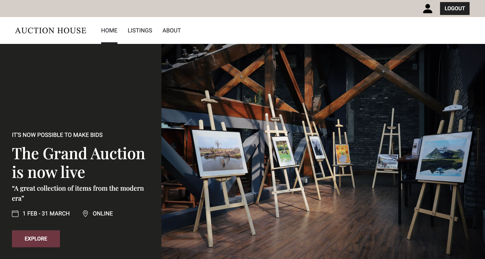

# auction-house



### Built using

[](https://getbootstrap.com/docs/5.2/getting-started/introduction/)
[](https://sass-lang.com/)

### Installation

```
npm install
```

### Dependencies

The project depends on Bootstrap for styling.

### Dev-dependencies

The project uses Sass for styling. To start the Sass compiler, run the following command:

```
npm run watch
```

### Build

```
npm run build
```

### Development Server

```
npm run dev
```

This will run the Sass compiler and start the Webpack development server using the concurrently package.

Please make sure that you have the required dev-dependencies installed before running the development server.

### Author

lhvk

[Link to live site](https://lhvk-auctionhouse.netlify.app/)

### License

This project is licensed under the ISC License.
